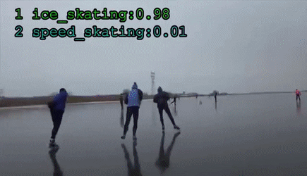

# 3D-CNN

#### This is Code Review of [https://github.com/FingerRec/real\_time\_video\_action\_recognition](https://github.com/FingerRec/real_time_video_action_recognition) that implemented pytorch real time video action recognition based on C3D. 

### C3D Sports Classification Demo



위의 움직이는 이미지는 다른 코드의 데모 \(참고 : [http://vlg.cs.dartmouth.edu/c3d/](http://vlg.cs.dartmouth.edu/c3d/)\) 이지만,   
C3D를 활용한 Sports Classification 의 가장 좋은 예시가 될 것 같아 가져왔다.   
영상에서 보이는 action으로부터 어떤 스포츠 class에 해당하는지, 그 확률을 예측하는 모습이다. 

### Class

리뷰하고자 하는 코드의 [list/classInd.txt](https://github.com/FingerRec/real_time_video_action_recognition/blob/master/list/classInd.txt) 를 살펴보면,   
분류할 class들이 나열되어 있다. 그는 다음과 같다. 

```text
1 ApplyEyeMakeup
2 ApplyLipstick
3 Archery
4 BabyCrawling
5 BalanceBeam
6 BandMarching
7 BaseballPitch
8 Basketball
9 BasketballDunk
10 BenchPress
11 Biking
12 Billiards
13 BlowDryHair
14 BlowingCandles
15 BodyWeightSquats
16 Bowling
17 BoxingPunchingBag
18 BoxingSpeedBag
19 BreastStroke
20 BrushingTeeth
21 CleanAndJerk
22 CliffDiving
23 CricketBowling
24 CricketShot
25 CuttingInKitchen
26 Diving
27 Drumming
28 Fencing
29 FieldHockeyPenalty
30 FloorGymnastics
31 FrisbeeCatch
32 FrontCrawl
33 GolfSwing
34 Haircut
35 Hammering
36 HammerThrow
37 HandstandPushups
38 HandstandWalking
39 HeadMassage
40 HighJump
41 HorseRace
42 HorseRiding
43 HulaHoop
44 IceDancing
45 JavelinThrow
46 JugglingBalls
47 JumpingJack
48 JumpRope
49 Kayaking
50 Knitting
51 LongJump
52 Lunges
53 MilitaryParade
54 Mixing
55 MoppingFloor
56 Nunchucks
57 ParallelBars
58 PizzaTossing
59 PlayingCello
60 PlayingDaf
61 PlayingDhol
62 PlayingFlute
63 PlayingGuitar
64 PlayingPiano
65 PlayingSitar
66 PlayingTabla
67 PlayingViolin
68 PoleVault
69 PommelHorse
70 PullUps
71 Punch
72 PushUps
73 Rafting
74 RockClimbingIndoor
75 RopeClimbing
76 Rowing
77 SalsaSpin
78 ShavingBeard
79 Shotput
80 SkateBoarding
81 Skiing
82 Skijet
83 SkyDiving
84 SoccerJuggling
85 SoccerPenalty
86 StillRings
87 SumoWrestling
88 Surfing
89 Swing
90 TableTennisShot
91 TaiChi
92 TennisSwing
93 ThrowDiscus
94 TrampolineJumping
95 Typing
96 UnevenBars
97 VolleyballSpiking
98 WalkingWithDog
99 WallPushups
100 WritingOnBoard
101 YoYo
```


