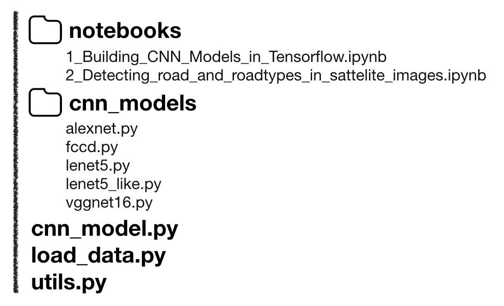

# Building CNN Models 1

#### This is Code Review of [https://github.com/taspinar/sidl](https://github.com/taspinar/sidl) that contains Deep Learning code to understand DL concepts. 

### Code Architecture



리뷰하고자 하는 코드의 구조를 알아둘 필요가 있을 것 같아 한번 첨부해보았다.   
이 페이지에서 리뷰하고자 하는 코드는 **1\_Building\_CNN\_Models\_in\_Tensorflow.ipynb** 이며,   
이는 전체 코드 중 모델을 학습시키는 메인 코드를 담당하고 하고 있다고 할 수 있다.   
즉, 아래에 나와있는 코드 모두를 import 하게 되는데,   
그 코드들에 대한 것은 다른 페이지에 따로 빼서 리뷰하도록 하겠다. 

### Import

```python
import sys
sys.path.insert(0,'..')

from cnn_models.lenet5 import *
from cnn_models.lenet5_like import *
from cnn_models.alexnet import *
from cnn_models.vggnet16 import *
from utils import *

# To load the MNIST dataset you will need to install 'python-mnist'
# Install it with 'pip install python-mnist'
import load_data as ld

from collections import defaultdict
current_path = os.path.realpath('..')
```

이 코드를 돌리는 데 필요한 모듈 및 파일들을 import 하고 있다.   
어떤 것들을 import 했는지 찬찬히 살펴보도록 하자.

1. sys 모듈

   ```python
   import sys
   sys.path.insert(0,'..') # sys.path.insert(0, 'py파일이 있는 경로')
   # import import_file
   ```

   이는 python에서 다른 디렉토리의 파일을 import 하고 싶을 때 쓰는 방법이다.  
  
   sys 모듈을 불러오면, 파이썬 인터프리터가 제공하는 함수 및 변수를 직접 제어할 수 있다.  
   하지만 이 때 import 할 수 있는 파일에는, 같은 디렉토리나 sys.path 내의 파일만 해당된다.   
   현재 이 코드의 위치는 _notebooks_ 이름의 폴더에 들어있지만,   
   import 하고자 하는 코드들은 모두 폴더 밖에 있으므로, 위와 같은 방법을 통해 경로를 열어준다.  

2. cnn\_models

   ```python
   from cnn_models.lenet5 import *
   from cnn_models.lenet5_like import *
   from cnn_models.alexnet import *
   from cnn_models.vggnet16 import *
   from utils import *
   ```

   cnn\_models 디렉토리 내에는 여러가지 모델을 구현해놓은 파일들이 담겨 있다.  
   각 model들과 utils.py 에 대해서는 다음 링크에서 자세히 설명해두었다.  

3.  load\_data

   ```python
   import load_data as ld
   ```

   본 코드에서는 MNIST 데이터를 통해 학습하였다. MNIST 데이터를 불러오는 파일이다.  
   자세히는 다음 링크를 따라가면 설명되어 있다.  

4. defaultdict 모듈, current\_path 지정

   ```python
   from collections import defaultdict
   current_path = os.path.realpath('..')
   ```

   defaultdict 모듈을 불러온다.  
   os 모듈은 utils.py 에서 불러왔기 때문에 여기서는 생략되었다.  
   current\_path를 현재보다 상위 디렉토리로 지정해준다.

#### 

> 출처 목록
>
> sys 모듈 \|  [https://weejw.tistory.com/40](https://weejw.tistory.com/40) \[위지원의 삽질 블로그\]  
> defaultdict 모듈 \|

