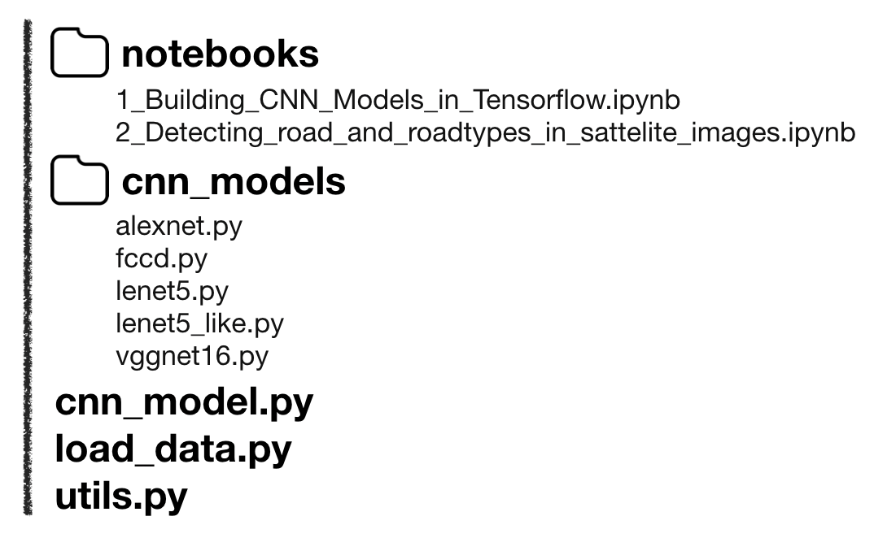

# Building CNN Models 1

#### This is Code Review of [https://github.com/taspinar/sidl](https://github.com/taspinar/sidl) that contains Deep Learning code to understand DL concepts. 

### Code Architecture



리뷰하고자 하는 코드의 구조를 알아둘 필요가 있을 것 같아 한번 첨부해보았다.   
이 페이지에서 리뷰하고자 하는 코드는 **1\_Building\_CNN\_Models\_in\_Tensorflow.ipynb** 이며,   
이는 전체 코드 중 모델을 학습시키는 메인 코드를 담당하고 하고 있다고 할 수 있다.   
즉, 아래에 나와있는 코드 모두를 import 하게 되는데,   
그 코드들에 대한 것은 하위 페이지로 따로 빼서 리뷰하도록 하겠다. 

### Import

```python
import sys
sys.path.insert(0,'..')

from cnn_models.lenet5 import *
from cnn_models.lenet5_like import *
from cnn_models.alexnet import *
from cnn_models.vggnet16 import *
from utils import *

# To load the MNIST dataset you will need to install 'python-mnist'
# Install it with 'pip install python-mnist'
import load_data as ld

from collections import defaultdict
current_path = os.path.realpath('..')
```

이 코드를 돌리는 데 필요한 모듈 및 파일들을 import 하고 있다.   
어떤 것들을 import 했는지 찬찬히 살펴보도록 하자.

1. sys 모듈

   ```python
   import sys
   sys.path.insert(0,'..') # sys.path.insert(0, 'py파일이 있는 경로')
   # import import_file
   ```

   이는 python에서 다른 디렉토리의 파일을 import 하고 싶을 때 쓰는 방법이다.  
  
   sys 모듈을 불러오면, 파이썬 인터프리터가 제공하는 함수 및 변수를 직접 제어할 수 있다.  
   하지만 이 때 import 할 수 있는 파일에는, 같은 디렉토리나 sys.path 내의 파일만 해당된다.   
   현재 이 코드의 위치는 _notebooks_ 이름의 폴더에 들어있지만,   
   import 하고자 하는 코드들은 모두 폴더 밖에 있으므로, 위와 같은 방법을 통해 경로를 열어준다.  

2. cnn\_models

   ```python
   from cnn_models.lenet5 import *
   from cnn_models.lenet5_like import *
   from cnn_models.alexnet import *
   from cnn_models.vggnet16 import *
   from utils import *
   ```

   cnn\_models 디렉토리 내에는 여러가지 모델을 구현해놓은 파일들이 담겨 있다.  
   LeNet-5 \[ [lenet5.py](lenet5.py.md) \], AlexNet \[ [alexnet.py](alexnet.py.md) \], VGGNet \[ [vggnet16.py](vggnet16.py.md) \] 이 있다.   
   utils.py 에는 학습을 위해 필요한 여러가지 함수들을 정의해놓았다. \[[ page link to utils.py](utils.py.md) \]  
   옆의 링크를 따라가면 자세한 설명을 볼 수 있다.   

3.  load\_data

   ```python
   import load_data as ld
   ```

   본 코드에서는 MNIST, CIFAR-10, oxflower-17 세 가지 데이터를 통해 학습하였다.   
   load\_data.py는 그 데이터들을 불러오는 파일이다. 이 파일을 ld 라는 이름으로 불러온다.   
   이 코드에 대한 자세한 설명은 다음 링크를 따라가면 된다. \[[ page link to load\_data.py](load_data.py.md) \]  

4. defaultdict 모듈, current\_path 지정

   ```python
   from collections import defaultdict
   current_path = os.path.realpath('..')
   ```

   defaultdict 모듈을 불러온다. ~~\(나중에 어떻게 쓰이는지 보고 내용 추가\)~~  
  
   앞으로 쓰일 현재 경로\(current\_path\)를 지정해주기 위해 os 모듈의 함수를 사용할텐데,   
   os 모듈은 utils.py 에서 불러왔기 때문에 여기서는 import 하는 코드가 생략되었다.   
   current\_path를 현재\(_notebooks_\)보다 상위 디렉토리로 지정해준다.

### Load Data

```python
#1. The MNIST dataset: http://yann.lecun.com/exdb/mnist/
mnist_folder = os.path.join(current_path, 'datasets/mnist/')
mnist_image_width, mnist_image_height, mnist_image_depth, mnist_num_labels = 28, 28, 1, 10
train_dataset, train_labels, test_dataset, test_labels = ld.mnist(mnist_folder, mnist_image_width, mnist_image_height, mnist_image_depth)

#2. The Cifar-10 dataset: https://www.cs.toronto.edu/~kriz/cifar.html
c10_folder = os.path.join(current_path, 'datasets/cifar10/')
c10_image_width, c10_image_height, c10_image_depth, c10_num_labels = 32, 32, 3, 10
train_dataset, train_labels, test_dataset, test_labels = ld.cifar10(c10_folder, c10_image_width, c10_image_height, c10_image_depth)

#3. The oxflower-17 dataset: http://www.robots.ox.ac.uk/~vgg/data/flowers/17/
ox16_folder = os.path.join(current_path, 'datasets/oxflower17/')
ox17_image_width, ox17_image_height, ox17_image_depth, ox17_num_labels = 224, 224, 3, 17
import tflearn.datasets.oxflower17 as oxflower17
train_dataset_, train_labels_ = oxflower17.load_data(one_hot=True)
train_dataset, train_labels = train_dataset_[:1000,:,:,:], train_labels_[:1000,:]
test_dataset, test_labels = train_dataset_[1000:,:,:,:], train_labels_[1000:,:]
```

앞서 말했듯, 여기서 사용할 데이터셋으로는 MNIST, CIFAR-10, oxflower-17 이렇게 세 가지이다.   
각 데이터셋은 앞서 설정해준 current\_path \(가장 상위 경로\)의 _datasets_ 라는 디렉토리에,   
각 데이터셋 이름으로 된 폴더로 나눠 저장해 준다.

1. MNIST 이는 손글씨로 된 숫자 이미지 데이터셋으로,  training set은 6만 개의 이미지, test set은 1만 개의 이미지로 되어 있다.  이미지는 그레이스케일의 28 x 28 사이즈이며,  0부터 9까지 각 이미지가 어떤 숫자를 나타내는지 예측하는 것이 목적이다.   따라서 mnist\_image\_width 및 mnist\_image\_height는 28, 28이 되며,  그레이스케일 이므로 mnist\_image\_depth는 1이 된다. mnist\_num\_labels는 0부터 9까지, 총 10이 된다.  
2. CIFAR-10  
   이는 이미지 분류를 위한 데이터셋으로,   
   training set은 5만 개의 이미지, test set은 1만 개의 이미지로 되어 있다.   
   이미지는 32 x 32 크기의 컬러 이미지이며,   
   다음의 총 10개 라벨 중 어떤 라벨에 속하는지 분류하는 것이 목적이다. 

   > airplane, automobile, bird, cat, deer, dog, frog, horse, ship, and truck.

   따라서 c10\_image\_width 및 c10\_image\_height는 32, 32가 되며,  
   컬러 이미지 이므로 c10\_image\_depth는 3이 된다.  
   c10\_num\_labels는, 라벨이 총 10개이기에 10이 된다. 

3. oxflower-17 꽃 데이터셋 ~~\(load.py 코드 리뷰하고나서 내용 추가\)~~


> 출처 목록
>
> sys 모듈 \|  [https://weejw.tistory.com/40](https://weejw.tistory.com/40) \[위지원의 삽질 블로그\]  
> defaultdict 모듈 \|

