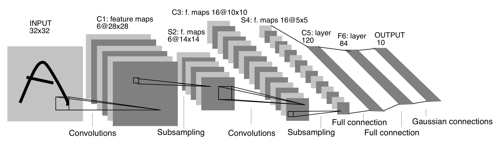

# lenet5.py

### Import

```python
import tensorflow as tf
from utils import *
```

tensorflow를 사용한 구현이므로 tensorflow를 불러오고,  
utils에서 필요한 함수를 사용할 것이기 때문에 utils도 불러와 준다. 

### LeNet-5 



LeNet-5는 3개의 Convolution layer \(C1, C3, C5\) 와 2개의 Subsampling\(Pooling\) layer \(S2, S4\),   
1개의 Fully-connected layer \(F6\), 그리고 output layer로 구성되어 있다.   
Activation function 으로는 sigmoid를 썼으며, Subsampling 방법으로는 Average pooling을 썼다. 

[코드 작성자의 블로그](http://ataspinar.com/2017/08/15/building-convolutional-neural-networks-with-tensorflow/)를 따라가 보면, 5개의 layer로 구분짓고 있다. 

> * **layer 1 :** a convolutional layer, with a sigmoid activation function, followed by an average pooling layer. \[C1+S2\]
> * **layer 2 :** a convolutional layer, with a sigmoid activation function, followed by an average pooling layer. \[C3+S4\]
> * **layer 3 :** a fully connected network \(sigmoid activation\) \[C5\]
> * **layer 4 :** a fully connected network \(sigmoid activation\) \[F6\]
> * **layer 5 :** the output layer \[OUTPUT\]

이에 따라 5개의 weight 과 bias 가 필요하며, 모델은 12줄의 코드로 완성하였다고 한다.   
\(5 layers + 2 pooling + 4 activation functions + 1 flatten layer\)

### 변수 지정

```python
LENET5_BATCH_SIZE = 32
LENET5_FILTER_SIZE = 5
LENET5_FILTER_DEPTH_1 = 6
LENET5_FILTER_DEPTH_2 = 16
LENET5_NUM_HIDDEN_1 = 120
LENET5_NUM_HIDDEN_2 = 84
```

배치 사이즈는 32로 지정하였다.   
Filter size는 kernel 사이즈와 같다. LeNet-5에서는 5x5 kernel을 사용하였다.   
Filter depth는 필터의 개수이다. C1에서는 6개, C3에서는 16개를 사용하여 feature map을 산출해냈다.   
Num\_Hidden은 C5과 F6의 feature map 및 유닛의 개수로, 각각 120개, 84개이다. 

### Function variables\_lenet5

weight 및 bias 생성 함수이다.   
앞서 설정해준 변수들을 input으로 받고,   
\(코드는 MNIST 기준\) input 이미지 사이즈, depth, label 수 \(28 x 28, 1, 10\)도 input으로 넣어준다.

```python
def variables_lenet5(filter_size = LENET5_FILTER_SIZE, filter_depth1 = LENET5_FILTER_DEPTH_1, 
                     filter_depth2 = LENET5_FILTER_DEPTH_2, 
                     num_hidden1 = LENET5_NUM_HIDDEN_1, num_hidden2 = LENET5_NUM_HIDDEN_2,
                     image_width = 28, image_height = 28, image_depth = 1, num_labels = 10):
    
    w1 = tf.Variable(tf.truncated_normal([filter_size, filter_size, image_depth, filter_depth1], stddev=0.1))
    b1 = tf.Variable(tf.zeros([filter_depth1]))

    w2 = tf.Variable(tf.truncated_normal([filter_size, filter_size, filter_depth1, filter_depth2], stddev=0.1))
    b2 = tf.Variable(tf.constant(1.0, shape=[filter_depth2]))

    w3 = tf.Variable(tf.truncated_normal([(image_width // 5)*(image_height // 5)*filter_depth2, num_hidden1], stddev=0.1))
    b3 = tf.Variable(tf.constant(1.0, shape = [num_hidden1]))

    w4 = tf.Variable(tf.truncated_normal([num_hidden1, num_hidden2], stddev=0.1))
    b4 = tf.Variable(tf.constant(1.0, shape = [num_hidden2]))
    
    w5 = tf.Variable(tf.truncated_normal([num_hidden2, num_labels], stddev=0.1))
    b5 = tf.Variable(tf.constant(1.0, shape = [num_labels]))
    variables = {
        'w1': w1, 'w2': w2, 'w3': w3, 'w4': w4, 'w5': w5,
        'b1': b1, 'b2': b2, 'b3': b3, 'b4': b4, 'b5': b5
    }
    return variables
```

1. w1, b1 w1 : C1, b1: sigmoid
2. w2, b2 w2 : C3, b2 : sigmoid
3. w3, b3 C5
4. w4, b4 F6
5. w5, b5 OUTPUT

### Function model\_lenet5

LeNet-5의 모델 구현 함수이다.   
data와, 앞서 variables\_lenet5 함수를 통해 구한 weight&bias matrix를 input으로 받는다. 

```python
def model_lenet5(data, variables):
    layer1_conv = tf.nn.conv2d(data, variables['w1'], [1, 1, 1, 1], padding='SAME')
    layer1_actv = tf.sigmoid(layer1_conv + variables['b1'])
    layer1_pool = tf.nn.avg_pool(layer1_actv, [1, 2, 2, 1], [1, 2, 2, 1], padding='SAME')

    layer2_conv = tf.nn.conv2d(layer1_pool, variables['w2'], [1, 1, 1, 1], padding='VALID')
    layer2_actv = tf.sigmoid(layer2_conv + variables['b2'])
    layer2_pool = tf.nn.avg_pool(layer2_actv, [1, 2, 2, 1], [1, 2, 2, 1], padding='SAME')

    flat_layer = flatten_tf_array(layer2_pool)
    layer3_fccd = tf.matmul(flat_layer, variables['w3']) + variables['b3']
    layer3_actv = tf.nn.sigmoid(layer3_fccd)
    
    layer4_fccd = tf.matmul(layer3_actv, variables['w4']) + variables['b4']
    layer4_actv = tf.nn.sigmoid(layer4_fccd)
    logits = tf.matmul(layer4_actv, variables['w5']) + variables['b5']
    return logits
```

1. Layer 1 C1과 S2 layer, 즉 첫번째 convolution layer와 subsampling layer 부분이며, 중간에 activation function 인 sigmoid 함수가 들어간다. 

