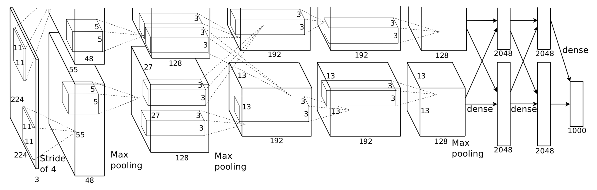
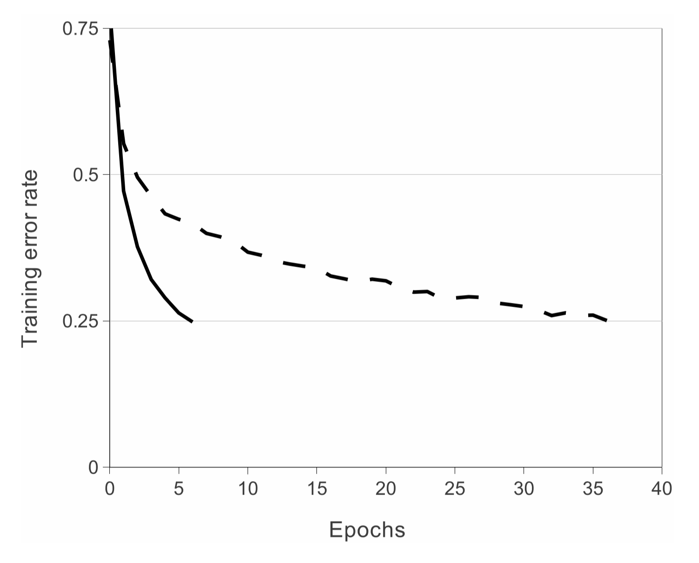

# ImageNet Classification with Deep Convolutional Neural Networks

#### 논문제목 : ImageNet Classification with Deep Convolutional Neural Networks  논문저자 : Alex Krizhevsky, Ilya Sutskever, Geoffrey E. Hinton

위 논문을 이해하기 위해서는, CNN에 대한 기본적인 이해가 필수적이다.   
CNN에 대한 설명은 아래 페이지에 따로 기재해두겠다.  
CNN에 대한 이해가 필요할 시, 참고하기 바란다.



###  Abstract

> We trained a large, deep convolutional neural network to classify the 1.2 million high-resolution images in the ImageNet LSVRC-2010 contest into the 1000 different classes.

이 논문에서는 ImageNet LSVRC-2010의 120만여 개 고해상도 이미지를 분류해내는 CNN을 학습시켰다.   
top-1과 top-5 error rate를 각각 37.5%와 17.0%로 달성하였다.  
ILSVRC-2012 경연에서는 top-5 test error rate 15.3%를 최고 기록으로 달성하였다.

네트워크 구성

* 6천만 개의 파라미터, 65만 개의 뉴런
* 5개의 convolutional layer와 max-pooling layer
* 3개의 fully-connected layer
* 마지막 1000-way softmax layer

fully-connected layer에의 오버피팅 줄이기 위해,

* dropout 기법 사용

빠른 학습을 위해,

* non-saturating neuron
* 효율적인 GPU 사용  

### 1 Introduction

#### 1문단 : 데이터 설명

기계 학습에서는 좋은 성능을 내기 위해 많은 데이터셋을 필요로 하며,  
이미지 데이터셋이 부족해 생기는 문제점은 이미 널리 알려져 있다.

최근까지도, 라벨이 부착된 이미지 데이터셋은 상대적으로 적었으나,  
수백만 장의 이미지들이 완전히 분류되어 있는 LabelMe,   
1,500 만 장의 고해상도 이미지들이 22,000개의 카테고리로 라벨링되어 있는 ImageNet과 같이,  
더 큰 데이터셋들이 새롭게 나오고 있다.

#### 2+3문단 : CNN 설명

학습할 데이터셋이 큰 만큼, 학습 능력이 큰 모델이 필요하다.

Convolutional neural networks \(CNNs\) 는,

* 깊이\(depth\)나 폭\(breadth\)을 달리하여 능력을 제어할 수 있다.
* 이미지의 본질에 대하여 아주 강력하고 정확한 예측을 할 수 있다.
* \(namely, stationarity of statistics and locality of pixel dependencies\)

따라서 유사한 크기의 레이어를 가진 표준 피드 포워드 신경망 \(standard feedforward neural network\)과 비교하였을 때, CNN이 연결 및 파라미터가 훨씬 적어 쉽게 학습할 수 있다. 

하지만, CNN도 고해상도 이미지의 큰 데이터에 대해서는 여전히 많은 계산량을 필요로 한다.  
다행히도,  현재 GPU들이 아주 큰 CNN을 학습시키는 데 충분히 강력하다.   
또한 ImageNet 데이터셋의 데이터들이 충분히 라벨링되어 있어, 오버피팅 없이 이러한 모델을 학습시킬 수 있다. 

#### 4+5문단 : 본 논문의 모델 설명

본 논문에서는,  
ILSVRC-2010과 ILSVRC-2012에 사용된 ImageNet의 서브셋으로 아주 큰 CNN을 학습시켰다.

2D convolution을 GPU에 최적화하여 구현하였고, 누구나 사용할 수 있도록 배포했다. [https://code.google.com/archive/p/cuda-convnet/](https://code.google.com/archive/p/cuda-convnet/)

최종 네트워크는 5개의 convolutional layer와 3개의 fully-connected layer를 포함하고 있다.  
이 중 어떤 convolutional layer라도 빠진다면, 낮은 성능을 보였다.

\(Section3\) 네트워크에 성능을 높이고 학습시간을 줄이는, 새롭고 독특한 feature들을 많이 포함하고 있다.  
\(Section4\) 오버피팅 방지를 위한 몇몇 효과적인 기술들을 사용하였다.

5-6일에 걸쳐, 두 개의 GTX 580 3GB GPU로 학습시켰다.

### 2 The Dataset

#### ImageNet

* 1,500 만 개의 고해상도 이미지가 22,000개의 카테고리로 라벨링 되어 있는 데이터
* 이미지는 웹에서 수집, 라벨은 사람에 의해 붙여진 것 

#### ILSVRC

* ImageNet의 서브셋 \(1000개 카테고리, 카테고리 별 대략 1000개 이미지\)  활용 
* 대략 120만 개 training / 5만 개 validation / 15만 개 test 이미지
* ILSVRC-2010 : ILSVRC의 버전들 중 유일하게 test 셋의 라벨이 사용 가능 \(본 논문의 실험에 주로 사용됨\)
* ILSVRC-2012 \(competition\) : test 셋의 라벨이 사용 불가능 \(본 논문의 모델로 참여, \(Section6\) 대회 결과를 서술해 놓았다.\)

#### 두 가지 유형의 error rates \(top-1/top-5\)

* top-1 error rate : 모델이 가장 높은 확률로 예측한 라벨이 올바른 라벨이 아닐 확률
* top-5 error rate : 모델이 가장 높은 확률로 예측한 5가지의 라벨들 중 올바른 라벨이 없을 확률

> 1000개의 클래스로 훈련된 분류기의 top-5 error rate가 5%보다 작으면, 분류 능력이 상당히 좋다고 판단할 수 있다. 클래스가 1000개 정도 되면 가장 높은 확률로 판단한 다섯 개의 클래스는 서로 상당히 유사한 것들일 가능성이 크다. 가령 모두 강아지인데 조금씩 생김새가 다른 품종일 수도 있다. 따라서 top-5 error rate가 낮으면 분류기의 성능이 좋다고 판단할 수 있는 것이다.  
> 출처 : [https://bskyvision.com/422](https://bskyvision.com/422) \[top-5 error와 top-1 error의 의미\]

#### 데이터 전처리

ImageNet은 다양한 해상도의 이미지들로 이루어져있지만, 본 논문의 모델은 일정한 input 사이즈를 요구한다. 그래서, 

* 이미지를 256 x 256 사이즈로 down-sampling \(직사각형 이미지가 주어질 경우,  길이가 짧은 쪽을 256으로 맞추고, 중앙을 잘라 256 x 256 으로 맞춤\)
* Mean subtraction 각 픽셀에서 학습셋의 평균값을 빼어, 픽셀의 raw RGB값 도출 

### 3 The Architecture

> eight learned layers ⎯⎯⎯ five convolutional and three fully-connected.

#### 3.1 ReLU Nonlinearity

* saturating \(비선형\) 함수 : 결과값이 포화\(saturated\)되는 함수,  gradient vanishing 현상을 야기 \(탄젠트 함수 \[$$tanh(x)$$\], 시그모이드 함수 \[$$(1+e^{-x})^{-1}$$\]\)
* non-saturating \(비선형\) 함수 : 그 반대인 함수 \(ReLU 함수 \[$$max(0,x)$$\]\)

Gradient Descent를 사용하는 경우, saturating 함수들이 non-saturating 함수보다 느리다고 한다. 즉, Deep convolutional neural net은  ReLU 함수를 사용했을 때 탄젠트 함수보다 몇 배는 더 빠르다.  
\(Figure1\) CIFAR-10 데이터셋에서 ReLU가 tanh 함수에 비해 6배 더 빨랐다. 

#### 3.2 Training on Multiple GPUs

GTX 580 GPU 하나의 메모리는 3GB 라서, 120만 개의 학습 샘플을 학습시키기에는 너무 작다.   
따라서, 두 개의 GPU를 병렬로 구성하였다.

* 당시의 GPU는 cross-GPU 병렬성이 잘 구현되어 있어서,  host 메모리를 거치지 않고 GPU 메모리간의 직접 읽고 쓰기가 가능하다.
* 각 GPU에 커널\(또는 뉴런\)의 절반을 배치하였다.
* GPU는 오로지 특정 layer에서만 커뮤니케이션한다. \(layer3\)

> This means that, for example, the kernels of layer 3 take input from all kernel maps in layer 2. However, kernels in layer 4 take input only from those kernel maps in layer 3 which reside on the same GPU.

이 구조를 사용한 결과,   
GPU를 한 개 사용해 학습시켰을 때 보다 top-1과 top-5 error rate를 각각 1.7%, 1.2%씩 줄일 수 있었다.

#### 3.3 Local Response Normalization

#### 3.4 Overlapping Pooling

하나의 Pooling layer가 s 픽셀씩 떨어져서 , z x z 크기만큼 요약한다고 할 때, 

* s=z일 경우, CNN에서 전통적으로 흔히 사용하는 local pooling이 된다. 
* s&lt;z일 경우, overlapping pooling이 된다. \(pooling unit들이 겹치게 된다.\)

본 논문에서는 overlapping pooling 방식을 사용했다. \(s=2, z=3\)  
이는 non-overlapping 방식\(s=2, z=2\)과 비교했을 때, top-1과 top-5 error rate를 각각 0.4%, 0.3%씩 줄일 수 있었다. 또한 이 방식이 overfitting도 조금 줄여주는 것을 확인할 수 있었다. 

#### 3.5 Overall Architecture

### 4 Reducing Overfitting

#### 4.1 Data Augmentation

#### 4.2 Dropout

### 5 Details of learning

### 6 Results

#### 6.1 Qualitative Evaluations

### 7 Discussion

